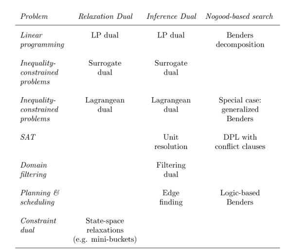

# Duality & Optimization
Duality in mathematics is usually reflexive `Dual Dual T = T`
Duality in optimization is usually *not reflexive*:
	- Linear programming duality is reflexive
	- Surrogacy, Langrangian, and Superadditive *are not reflexive*

**Inference duality**
	- **Always reflexive**
	- sensitivity analysis
	- nogood-based search
**Relaxation duality**
	- not necessarily reflexive
	- provides tight bounds
**Constraint duality**
	- gives rise to a relaxation dual

##### Inference Duality
A duality of **search** and **inference**
	- **Search** over *values* for best solution
	- **Infer** from *constraints* the best **bound on optimal solution**

Primal: Solve by search over values of variables.
Dual:		Solve by search over *proofs*, in domain of a family of proofs.

###### Weak Duality
**Always holds.**
Max of dual $ < $ Min of primal

duality gap $ = $ Max of Dual $ - $ Min of Primal

So its positive semi-definite.

It's **strong** when equality holds (zero definite)

```
For any u >= 0:
	uAx >= ub  is a surrogate of Ax >= b

uAx >= ub dominates cx >= v if (uAx >= ub implies cx >= v for x >= 0)
This is the same as:
	uA <= c and ub >= v
```
This allows *complete inference* due to **Farkas Lemma**
LP Duality is strong and symmetric.
Dual is in NP and primal in co-NP.

##### Relaxation Duality
A duality of **restriction** and **relaxation**
	- Enumerate **restrictions**
	- Enumerate **parameterized relaxations**

Relaxation parameters ~ dual variables
Each relaxation provides lower bound on optimal solution of primal.
Can search over dual variables' values to provide **tighest bound**.

$$ min_x\{\ f(x,u) | C(u) \} \Rightarrow{dual} \max_u \ min_x\{\ f(x,u) | C(u) \} $$

Weak duality **always** holds.
Max of dual <= Min of primal


##### Why
Three benefits of recognizing duality:
	1. reveal connections.
		- e.g. *surrogate* and *langrangian* duals are related when viewed as *inference* duals but not *relaxation* duals.
	2. unify solution methods.
		- e.g. *Benders Decomposition* and *DPL* are nogood-based search methods via different *inference* duals
	3. suggest new solution methods.
		- e.g. any domain filter defines an inference dual related to nogood-based search.
		- edge-finding ~ Benders-like decomposition for planning/scheduling
		- a relaxation dual can be defined on a constraint dual ~ *mini-bucket elimination*


### Nogood-Based Search
Derived from Inference Dual. Elimanate solutions already examined and solutions that are not better.
Search by enumerating partial assignments.
Next partial assignment must satisfy nogoods generated so far.

> Nogoods are obtained by *analyzing the inference dual* of the restricted problem that results from each partial assignment.

To solve: min f(x) | C
in each iteration, formulate restriction:
	  min f(x) | C union B
where B is a *partial assignment* that fixes some of the variables $x_j$
B may contain:
	- *branching constraints*
	- *solution of master problem* (Benders decomp.)
	- *unit resolution* (SAT solving with DPL)
in DPL, C would be _all_ logical clauses, nogoods would be _conflict clauses_
